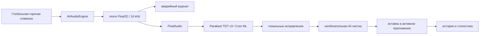

# VoiceToText

Нативное macOS-приложение для локального преобразования речи в текст. Нажмите
глобальную горячую клавишу, произнесите текст и нажмите её ещё раз — приложение
распознает запись на Mac и вставит результат в активное поле.

> Текущий статус: ранняя beta `0.1.0`. macOS-клиент готов к локальной сборке и
> тестированию. Публичный release-архив ещё не опубликован, поэтому установочная
> команда из интернета пока намеренно не предлагается.

## Что уже работает

- нативный интерфейс AppKit в стиле системного приложения macOS;
- глобальные настраиваемые горячие клавиши;
- захват через `AVAudioEngine` и нормализация в mono Float32, 16 кГц;
- локальное распознавание Parakeet TDT v3 через FluidAudio/Core ML;
- вставка результата в исходное приложение с восстановлением буфера обмена;
- фиксация исходного поля при старте записи: переключение или сворачивание
  окон во время диктовки не меняет адресата готового текста;
- история, статистика, словарь исправлений и импорт/экспорт;
- визуальный индикатор записи возле курсора;
- выбор микрофона, работа после sleep/wake и смены аудиоустройства;
- аварийное сохранение незавершённой записи;
- необязательная AI-чистка текста через совместимый с OpenAI API;
- встроенная диагностика, самотесты и безопасный механизм обновления.

## Изменения VoiceToText

- отдельные имя, bundle ID, LaunchAgent, настройки и каталоги данных — проект
  не конфликтует с установленным SuperDictate;
- максимальная длительность одной записи увеличена до **40 минут**;
- аварийный журнал рассчитан на **45 минут** аудио;
- добавлен независимый Swift-пакет `VoiceToTextCore`, который собирается без
  AppKit и AVFoundation и служит основой будущих Windows/Linux-клиентов;
- добавлены платформонезависимые контракты `PCMChunk`,
  `SpeechTranscribing`, `Transcript` и `TranscriptDestination`;
- CI отдельно проверяет portable core и macOS-приложение;
- добавлена документация архитектуры, разработки, тестирования, GitFlow и
  дальнейшего переноса на другие ОС.

## Требования для macOS

- Mac с Apple Silicon: M1 или новее;
- macOS 14 Sonoma или новее;
- Xcode Command Line Tools;
- интернет при первой загрузке модели (около 460 МБ).

Intel Mac пока не поддерживается. Windows и Linux находятся на стадии
архитектурной подготовки: общий core уже отделён, графические клиенты и
платформенные адаптеры ещё не реализованы.

## Быстрый запуск для разработки

```bash
cd ~/petproject/voice_to_text
xcode-select --install
./scripts/check.sh
swift run --package-path core VoiceToTextCoreChecks
swift run -c debug --package-path swift VoiceToText --self-test all
./scripts/build-app.sh ./dist/VoiceToText.app
```

Последняя команда создаёт подписанный ad-hoc bundle
`dist/VoiceToText.app`. Для постоянной установки используйте только стабильный
путь `/Applications/VoiceToText.app` и одну и ту же Apple Development подпись:

```bash
./scripts/install-local.sh
```

Если сертификатов несколько, укажите нужный явно:

```bash
VOICE_TO_TEXT_SIGN_IDENTITY="Apple Development: Your Name (TEAMID)" \
  ./scripts/install-local.sh
```

Скрипт атомарно заменяет только `/Applications/VoiceToText.app`, проверяет
bundle ID и подпись, затем перезапускает только фоновый агент VoiceToText. Он
не сбрасывает системные разрешения macOS.

## Первый запуск

1. Откройте `VoiceToText` из `/Applications`.
2. Разрешите доступ к микрофону, универсальному доступу и мониторингу ввода.
3. Дождитесь загрузки модели и статуса `Работает`.
4. Нажмите правый Command, говорите и нажмите правый Command ещё раз.
5. Проверьте, что текст появился в активном поле.

Модель загружается только при первом запуске. После этого обычное распознавание
работает локально без интернета.

Пока в GitHub-репозитории нет опубликованных Releases, endpoint
`/releases/latest` отвечает HTTP 404. Для VoiceToText это штатное состояние:
приложение показывает, что установлена актуальная версия, и не считает такой
ответ ошибкой. Скачивание обновлений станет доступно после первого подписанного
release.

## Горячие клавиши

- правый Command — начать или закончить диктовку;
- правый Option + правый Command — альтернативное завершение;
- правый Shift + правый Command — открыть быструю историю.

Все сочетания можно изменить в настройках. Повторное нажатие может либо просто
вставить текст, либо вставить его и нажать Enter.

Адресат фиксируется в момент начала записи. После распознавания VoiceToText
возвращает фокус исходному приложению, окну и текстовому полю и отправляет
вставку непосредственно процессу этого приложения. Если поле было закрыто или
приложение завершилось, текст остаётся в истории и не вставляется в случайное
активное окно.

## Как проходит распознавание



При 40 минутах mono Float32/16 кГц занимает примерно 153,6 МБ до учёта
дополнительных буферов и модели. Поэтому 40 минут — верхняя граница beta, а
следующее улучшение для длинных записей — обработка чанками с VAD и
file-backed буфером.

## Данные и приватность

- настройки, история и crash-recovery:
  `~/Library/Application Support/VoiceToText`;
- модель FluidAudio: `~/Library/Application Support/FluidAudio/Models`;
- LaunchAgent: `~/Library/LaunchAgents/com.fazzilka.voicetotext.agent.plist`;
- логи: `~/Library/Logs/VoiceToText*`;
- API-ключ AI-чистки: macOS Keychain, service
  `com.fazzilka.voicetotext.ai`.

Аудио и распознанный текст не отправляются в облако. Исключение — только
явно включённая пользователем AI-чистка: выбранному провайдеру отправляется
готовый текст, но не запись микрофона. Подробнее: [PRIVACY.md](PRIVACY.md).

## Структура репозитория

```text
core/                       portable Swift domain and contracts
swift/                      native macOS application
  Sources/VoiceToText/      AppKit/AVFoundation implementation
scripts/                    checks, bundle build, local installation
docs/                       architecture and engineering documentation
.github/workflows/          macOS and portable-core CI
```

Текущий macOS-клиент исторически сосредоточен в одном большом `main.swift`.
Это рабочая, но не конечная архитектура: план декомпозиции описан в
[docs/ARCHITECTURE.md](docs/ARCHITECTURE.md).

## Документация

- [Архитектура](docs/ARCHITECTURE.md)
- [Разработка и локальная сборка](docs/DEVELOPMENT.md)
- [Стратегия Windows/Linux](docs/CROSS_PLATFORM.md)
- [Тестирование](docs/TESTING.md)
- [Security audit](docs/SECURITY_AUDIT.md)
- [GitFlow](docs/GITFLOW.md)
- [Roadmap](docs/ROADMAP.md)
- [Приватность](PRIVACY.md)
- [Безопасность](SECURITY.md)
- [Происхождение и атрибуция](NOTICE.md)

## GitFlow

Проект следует схеме репозитория `deploy_pp_time_traking`: стабильная `main`,
изолированные `feature/<ID>-...`, `fix/<ID>-...` и `security/...`, обязательная
проверка перед Pull Request и merge в `main` через PR. Полные правила находятся
в [docs/GITFLOW.md](docs/GITFLOW.md).

## Удаление

```bash
./uninstall.sh
```

Приложение и LaunchAgent удаляются, а история и модель сохраняются, чтобы не
потерять данные. Полное удаление пользовательских данных выполняется только
вручную и описано в документации разработки.

## Происхождение и лицензия

VoiceToText — производный проект на основе
[SuperDictate](https://github.com/shlgd/SuperDictate), который, в свою очередь,
основан на [Parakey](https://github.com/rcourtman/parakey). Исходная MIT-лицензия
и уведомления сохранены. Подробности — в [LICENSE](LICENSE) и
[NOTICE.md](NOTICE.md).
