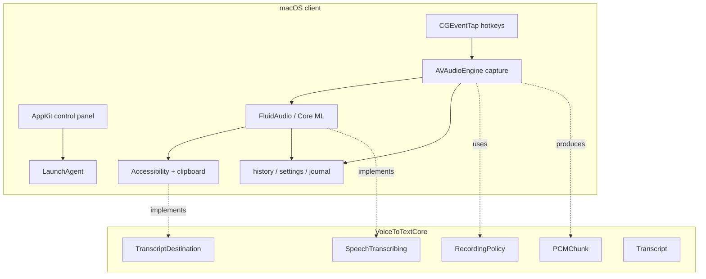

# Архитектура VoiceToText

## 1. Цели

VoiceToText должен давать минимальную задержку на macOS, хранить голос локально,
не терять запись при сбое и при этом позволять постепенно добавить Windows и
Linux. Поэтому нативные возможности ОС остаются в платформенном клиенте, а
правила и контракты выносятся в portable core.

## 2. Текущее устройство

Репозиторий состоит из двух Swift-пакетов:

- `core/` — платформонезависимые типы, лимиты и интерфейсы;
- `swift/` — исполняемый macOS-клиент и зависимость FluidAudio.

## 3. Путь одной диктовки

1. `CGEventTap` наблюдает настроенную глобальную комбинацию.
2. При начале записи `AVAudioEngine` подключает tap к выбранному input node.
3. `AVAudioConverter` переводит устройство в mono Float32, 16 кГц.
4. Сэмплы одновременно накапливаются для ASR и записываются в pending journal.
5. При завершении слишком короткая запись отбрасывается; нормальная передаётся
   в FluidAudio.
6. FluidAudio запускает Parakeet TDT v3 через Core ML, используя Apple Neural
   Engine там, где это поддерживается моделью и системой.
7. Результат проходит словарь исправлений, удаление слов-паразитов и опционально
   AI-cleanup.
8. Текст вставляется напрямую через Accessibility либо через буфер обмена с
   последующим восстановлением предыдущего содержимого.
9. Итог и метрики сохраняются в локальную историю; pending journal удаляется.

## 4. Процессы macOS

Один executable поддерживает несколько режимов:

- без аргументов — control panel;
- `--agent` — фоновая диктовка;
- `--update-progress` — компактное окно хода обновления;
- `--self-test <suite>` — диагностика без запуска `.app`;
- аргументы диагностики аудио и экспорта анимации.

LaunchAgent создаётся в
`~/Library/LaunchAgents/com.fazzilka.voicetotext.agent.plist` и запускает
`/Applications/VoiceToText.app/Contents/MacOS/VoiceToText --agent`.

## 5. Хранилища

| Данные | Место | Политика |
|---|---|---|
| Настройки | suite `com.fazzilka.voicetotext` | локально |
| История и статистика | `Application Support/VoiceToText` | локально |
| Pending audio journal | `Application Support/VoiceToText` | удаляется после обработки |
| Speech model | `Application Support/FluidAudio/Models` | общий кэш FluidAudio |
| AI API key | Keychain service `com.fazzilka.voicetotext.ai` | не пишется в plist/логи |
| Диагностика | `~/Library/Logs/VoiceToText*` | без текста диктовки |

Форматы импорта проверяют размер, версию схемы, symlink/hardlink и корректность
JSON. Модель проверяется по закреплённым хешам.

## 6. Concurrency-инварианты

- `AudioCapture` не должен становиться `@MainActor`: input tap вызывается на
  аудиопотоке, а нарушение приводит к runtime trap в Swift 6.
- UI и AppKit-объекты обновляются на main actor.
- одновременно допускается только одна транскрипция;
- input block `AVAudioConverter` возвращает `.noDataNow`, а не `.endOfStream`,
  иначе converter нельзя повторно использовать;
- фоновые callbacks не должны удерживать UI или аудиобуферы дольше необходимого.

Полный список эксплуатационных ограничений находится в `AGENTS.md`.

## 7. Длинные записи

`RecordingPolicy.maximumRecordingSeconds` равен 2400 секундам. При mono
Float32/16 кГц это 64 000 байт в секунду и примерно 153,6 МБ за 40 минут.
Pending journal допускает 2700 секунд, то есть 172 800 016 байт вместе с
16-байтовым заголовком.

Текущая beta завершает распознавание одним batch. Для дальнейшего увеличения
лимита требуется:

1. file-backed storage вместо единого массива;
2. VAD и разбиение по паузам;
3. overlap между чанками, чтобы не терять слова на границе;
4. инкрементальное объединение текста;
5. ограниченный пул ASR-задач и backpressure;
6. восстановление прогресса по чанкам после сбоя.

## 8. Технический долг и декомпозиция

Большая часть исторического macOS-кода находится в
`swift/Sources/VoiceToText/main.swift`. Безопасный порядок разделения:

1. value types и чистые функции;
2. persistence и форматы;
3. audio capture;
4. ASR adapter;
5. paste/output adapter;
6. agent lifecycle;
7. control panel и settings UI;
8. updater.

Каждый перенос делается отдельным PR без изменения поведения и с запуском
полного self-test набора.

## 9. Граница portable core

Core не импортирует AppKit, AVFoundation, CoreGraphics, Security или
ServiceManagement. В нём допустимы:

- доменные типы и validation;
- политика длительности/форматов;
- алгоритмы объединения чанков и нормализации текста;
- интерфейсы ASR и доставки результата;
- сериализуемые DTO без платформенных URL/bookmark объектов.

Разрешения, микрофон, хоткеи, tray/menu bar, clipboard, autostart и secure
storage остаются адаптерами конкретной ОС.
