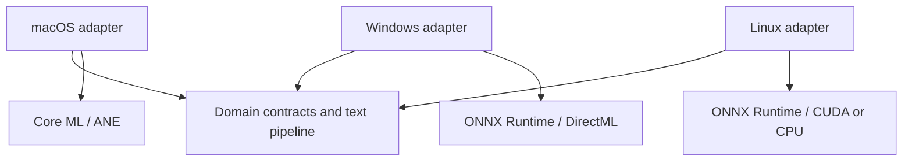

# Стратегия Windows и Linux

## Текущее состояние

macOS — единственный полноценный клиент. `core/` уже не зависит от API Apple и
проверяется на Linux в CI. Это архитектурный фундамент, а не обещание, что
текущий `.app` запускается на других ОС.

## Почему macOS остаётся на Swift

Для текущего клиента Swift даёт прямой доступ к AVAudioEngine, Core ML/ANE,
CGEventTap, Accessibility, Keychain, LaunchAgent и AppKit. Python добавил бы
межпроцессный слой, упаковку runtime и более сложную работу с разрешениями, но
не ускорил бы сам Core ML inference.

Portable core также написан на Swift, но его контракты не привязаны к языку:
при необходимости Windows/Linux-клиент может реализовать их на Rust, C++ или
.NET и обмениваться общими JSON-схемами.

## Карта платформенных адаптеров

| Возможность | macOS сейчас | Windows вариант | Linux вариант |
|---|---|---|---|
| Захват аудио | AVAudioEngine | WASAPI | PipeWire/PulseAudio |
| Глобальный hotkey | CGEventTap | RegisterHotKey/Raw Input | X11/Wayland portal |
| ASR runtime | FluidAudio/Core ML | ONNX Runtime/DirectML | ONNX Runtime/CUDA/CPU |
| UI/tray | AppKit | WinUI 3/WPF | GTK4/Qt |
| Вставка текста | Accessibility/CGEvent | UI Automation/SendInput | XTest/Wayland portal |
| Secure storage | Keychain | Credential Manager/DPAPI | Secret Service |
| Autostart | LaunchAgent | Startup Task | systemd user/XDG autostart |
| Обновления | подписанный `.app` | MSIX/подписанный installer | AppImage/Flatpak package |

## Целевая схема

## Контракты первой версии

- `PCMChunk`: mono Float32 samples и sample rate;
- `SpeechTranscribing`: async преобразование PCM в `Transcript`;
- `TranscriptDestination`: доставка результата в выбранное место;
- `RecordingPolicy`: единые лимиты и формат recovery journal.

Следующими в core переносятся:

- chunk descriptor и временные метки;
- VAD segments;
- merge policy для overlapping chunks;
- text normalization и corrections;
- формат истории без platform bookmark/security scope;
- provider-neutral AI cleanup request/response.

## Этапы Windows

1. Консольный capture adapter через WASAPI.
2. ONNX-модель и benchmark CPU/DirectML.
3. End-to-end команда: запись → ASR → stdout/clipboard.
4. WinUI tray и настройка hotkey.
5. UI Automation, secure storage и autostart.
6. Подписанный MSIX, обновление и installer smoke test.

## Этапы Linux

1. Проверить core на Ubuntu в CI (уже сделано).
2. PipeWire capture с fallback PulseAudio.
3. ONNX Runtime CPU, затем CUDA при наличии.
4. GTK4/Qt tray и DBus/Secret Service.
5. Отдельно проверить X11 и Wayland: глобальные hotkeys и synthetic input в
   Wayland ограничены compositor/portal политикой.
6. AppImage или Flatpak и smoke tests на поддерживаемых дистрибутивах.

## Критерий готовности новой платформы

Платформа считается поддерживаемой только если есть воспроизводимая сборка,
подписанный/проверяемый пакет, unit tests core, capture/ASR integration tests,
ручная проверка разрешений, документированный uninstall и измерения latency,
RAM и word error rate на одинаковом наборе аудио.
